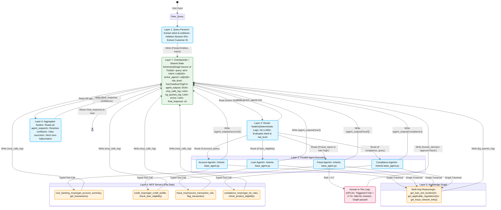

# FinCore Intelligent Banking Assistant - Detailed Architecture Diagram

This diagram represents the flow of data and state transitions through the 7 layers of the system.

## Success Metrics & Constraints
- **Latency**: p90 < 4 seconds end-to-end
- **Accuracy**: Zero hallucinations, responses grounded strictly in retrieved data
- **Auditability**: 100% logging of all MCP calls (`mcp_calls_log`) and KG queries (`kg_queries_log`)
- **Compliance**: Adherence to RBI + DPDP Act guidelines

## Architecture Diagram (Mermaid)

