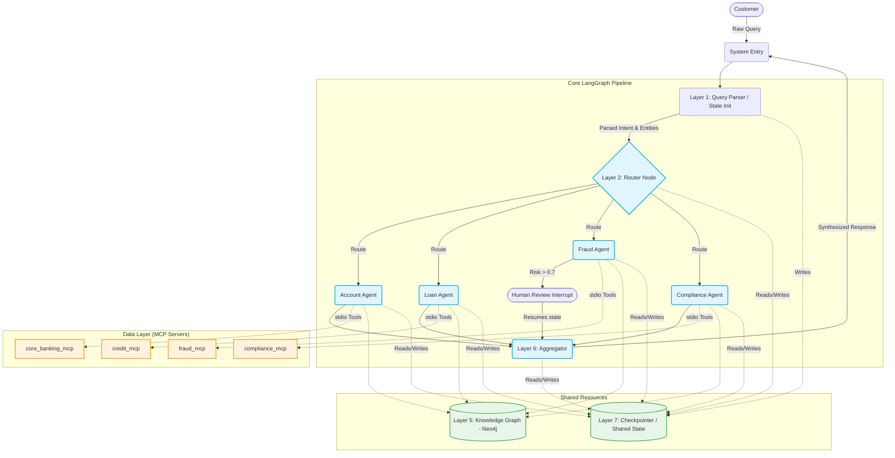

# FinCore Intelligent Banking Assistant Implementation Plan

## Goal Description
Build a multi-agent AI system for FinCore Bank that efficiently handles complex, multi-intent customer queries across four specialized domains: Loan, Fraud, Account, and Compliance. The system will leverage a centralized LangGraph pipeline running isolated MCP tool calls for data access and a dedicated Neo4j/NetworkX Knowledge Graph (KG) for multi-hop cross-entity reasoning. Designed against a strict 4-second SLA with an internal focus on explainability and a zero-hallucination tolerance policy.

## Proposed Changes

### 1. Pre-Design Decisions (Phase 0)
- **LLM Choice:** `gpt-4o` (or preferred pinned substitute, to be aligned explicitly via `.env`).
- **KG Backend:** `Neo4j` (User requested upgrade from NetworkX; will use Neo4j AuraDB or local instance via URI/Credentials).
- **MCP Transport:** `stdio` format locally.
- **Async Strategy:** Full `asyncio` stack with LangGraph async flows to handle fan-out.
- **Checkpointer:** `SqliteSaver` for session and thread state continuity. 

### 2. File & Component Structure
We will scaffold the following core structure per the assignment:
- `src/graph/` (LangGraph state definition, main graph wiring, router, and aggregator logic)
- `src/agents/` (Base agent class ensuring logging compliance, plus the 4 domain-specific agents)
- `src/mcp_servers/` (4 typed FastMCP servers serving mock data)
- `src/knowledge_graph/` (KG schema definition, queries, seeding scripts with `Faker`)

### 3. Architecture Diagram

### 4. Phase 6: Bonus Challenges
These items are targeted for final submission to maximize evaluation marks:
- **Bonus A: Fraud Network Visualization**: Implement a `.visualize_fraud_ring()` method in `FraudAgent` using `matplotlib` to render the `LINKED_TO` sub-graph from Neo4j.
- **Bonus B: Adaptive Routing**: Refactor `router_node` to use an LLM-based classifier that returns confidence scores, allowing for multi-agent fan-out based on probability thresholds.
- **Bonus C: Streaming Responses**: Implement `astream_events` in `main.py` to provide real-time updates as nodes complete execution.

## Verification Plan

### Automated Tests
1. **MCP Connectivity Mock Verification (`pytest`):** Verify each FastMCP backend returns expected structured output types using typed requests.
2. **Knowledge Graph Traversal:** Dedicated tests to assert accurate multi-hop answers (e.g. validating `get_loan_emi_burden()`) leveraging dummy seeded faker data.
3. **End-to-End Test Scenarios:** Emulate execution over the 8 test scenarios defined in Section 5. Will heavily unit-test structured parser logic outputs. 

### Manual Verification
1. **Parallel Execution Traces:** Manually observe `active_agents` running natively on LangGraph's event stream.
2. **Audit Trails:** Cross check that `mcp_calls_log` and `kg_queries_log` are safely embedded within `agent_outputs`.
3. **Latency Benchmarking:** Observe end-to-end execution times over the 8 test scenarios, profiling slow queries if `p90` bounds exceed 4 seconds.
